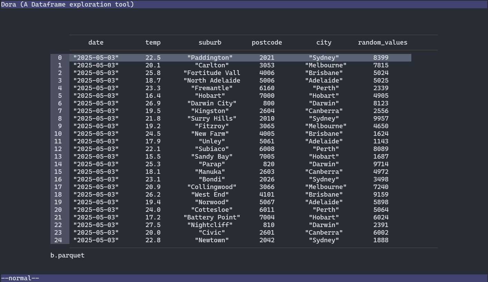
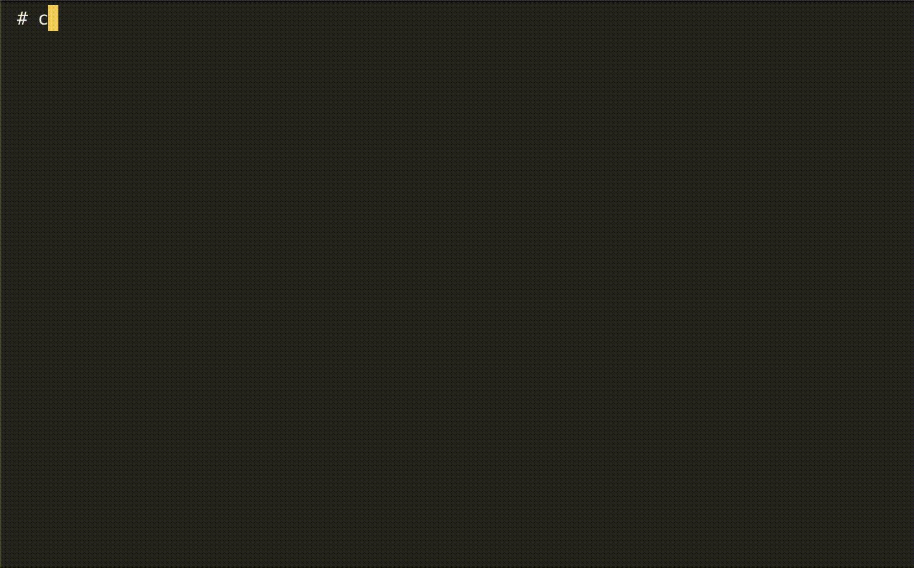
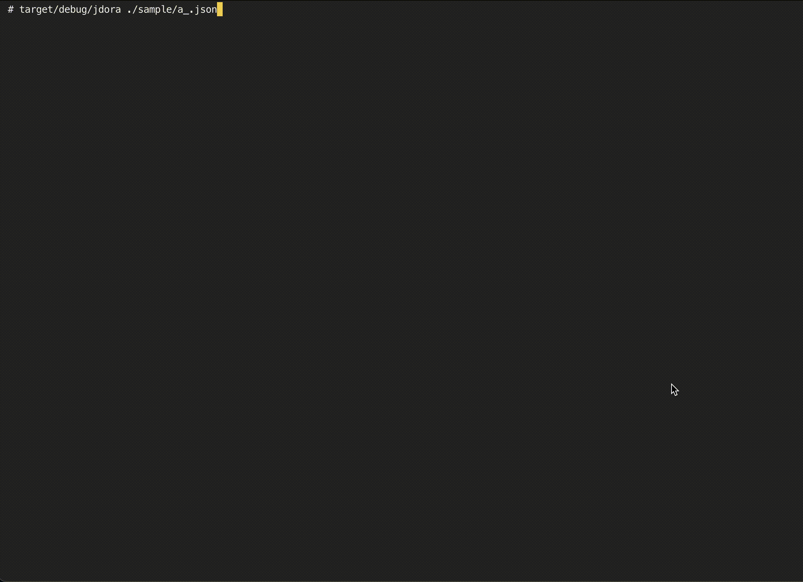

# dora
like dora...the explorer, exploring data files like csv/parquet/xlsx in the terminal

## The apps:
- [dora](./dora/README.md) is a TUI dataframe visualiser with GCS support.
    - 
- [dora-explorer](./dora-explorer/README.md) is a TUI file navigator with GCS support.
    - 
- [jdora](./jdora/README.md) is an interactive terminal json visualiser, it will have collapse and search capabilities.
    - 

## References
Code structure and functionality heavily inspired from https://github.com/YS-L/csvlens
Built on top of:
- ratatui
- polars